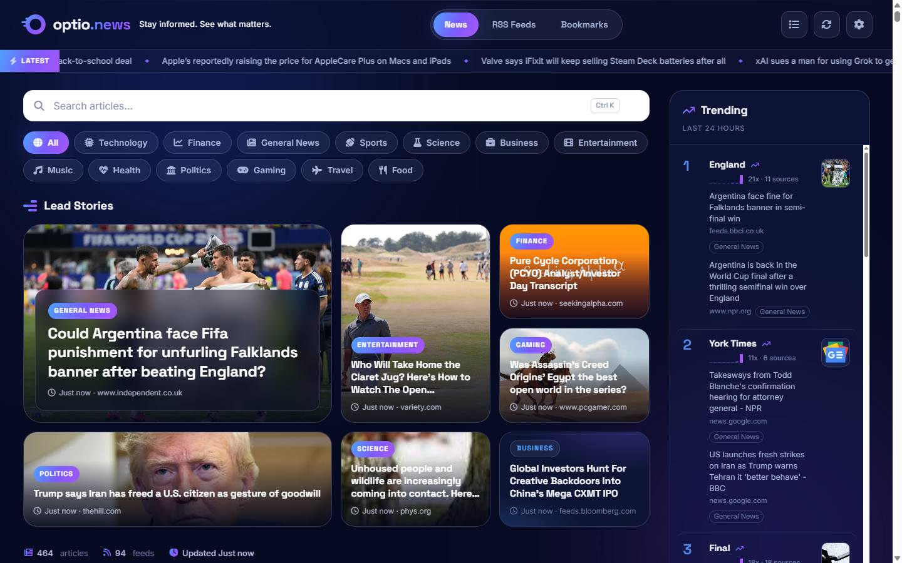
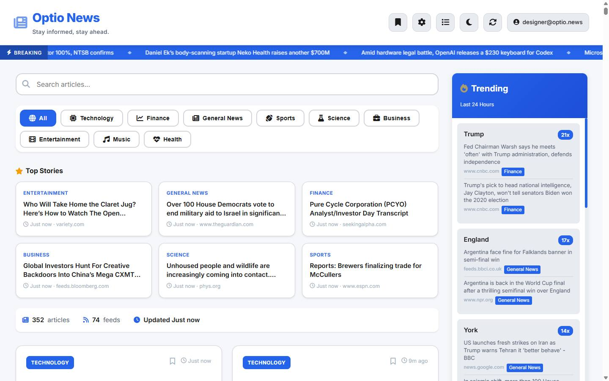
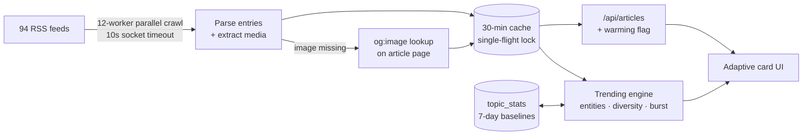
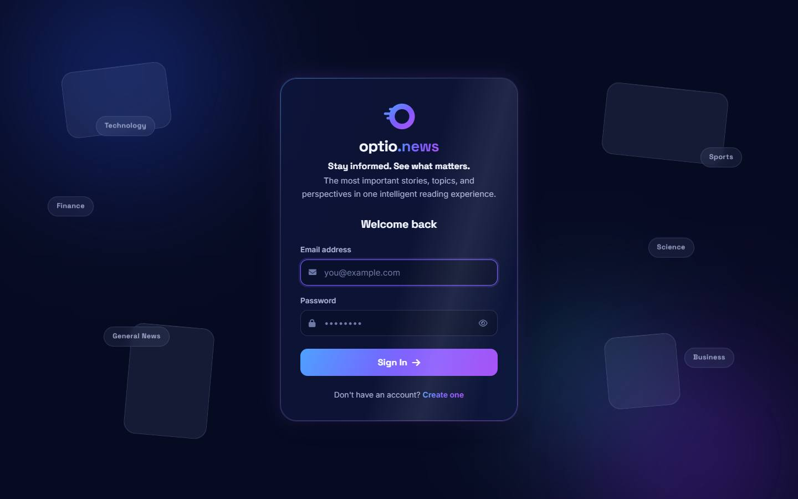
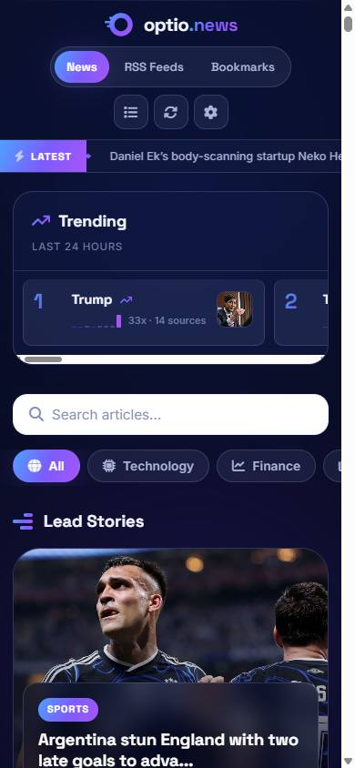

# Turning 94 raw RSS feeds into an image-forward news platform that loads instantly

Optio.News aggregates 94 sources across 13 categories into an editorial, photography-led reading experience — powered by a parallel crawl pipeline, article-page image enrichment, and statistically grounded trend detection, all on a single Flask service.

*The live front page. Every panel is real syndicated content — the composition, imagery, and trending rankings assemble themselves from the data pipeline.*

## The short version

Optio.News began as a personal answer to fragmented news reading: one place aggregating the sources I trust, with per-user feed control and bookmarking. The functional version worked but read like a database dump — uniform text cards, almost no imagery, a trending list polluted by word fragments, and a first load that hung for minutes while 90+ feeds fetched one at a time.

I rebuilt it as an editorial product. The key move wasn't visual: it was recognizing that **the interface could only ever be as good as the data feeding it**. I parallelized the crawl, recovered missing imagery from the article pages themselves, sanitized junk metadata, and rebuilt trending around entity merging, source diversity, and burst detection. The UI then adapts to what each article actually has, instead of forcing every story into the same box.

| Result | Measurement |
|---|---|
| **98%** of articles carry real photography | was ~60% · measured 328/336 live |
| **Instant** first paint at any cache state | was a multi-minute blocked load |
| **56/56** tests passing on every deploy | suite runtime 35s → 17s |
| **94** sources across 13 categories | ~450 articles per refresh |

## The challenge: syndication data fights good design

Three compounding problems defined the work:

**The imagery problem.** Roughly 40% of aggregated articles carried no usable image in their RSS metadata — entire high-volume sources like TechCrunch ship none at all. An "image-forward" design was impossible on top of that.
> Measured: 207 of 344 articles had RSS-supplied imagery in a live snapshot.

**The cold-start problem.** The crawler fetched ~94 feeds serially. On a fresh deploy, the first visitor's request blocked behind the entire crawl — the page simply appeared to never load. Server logs showed the background cache-warmer and the first page request running the *same* serial crawl concurrently: the hang was self-inflicted duplication, not slow sources.

**The trending problem.** Frequency counting made "trending" meaningless. Capitalized sentence-starters ("Where", "Behind") masqueraded as proper nouns, name fragments ("York") ranked separately from their entities, and perennial topics dominated every day regardless of actual news.

**Problem statement:** make unreliable third-party syndication data support a premium editorial experience — without adding infrastructure, frameworks, or cost.

**Constraints I chose to honor:** a single small server (no CDN, no queue, no search service), no client framework, additive-only schema changes, and no fabricated UI states — no fake "breaking news" labels, no invented engagement numbers.

## Key insight

> **Every visible quality problem traced back to the data layer. Fix the pipeline once, and the design system, the hero, and trending all get better for free.**

## Before / after — same viewport, same live data

| March 2026 build | July 2026 build |
|---|---|
|  |  |
| Uniform text cards, zero imagery, and a trending list showing the "York" fragment bug — captured from the actual pre-redesign commit. | Same account, same 1440×900 viewport, live feeds. The lead mosaic, card variety, and merged trending entities are all pipeline-driven. |

## The solution: four systems

### 1 — Parallel, self-healing ingest

A 12-worker thread pool crawls all feeds with per-socket timeouts, guarded by a single-flight lock so only one crawl runs process-wide. Articles missing imagery get a second parallel pass that fetches their pages and extracts `og:image` / `twitter:image` — capped and time-boxed so a slow site can never stall the refresh.

> One live run recovered 101 of 108 missing images · coverage 60% → 98% · test suite 35s → 17s as a side effect.

### 2 — Honest loading

During the one cold crawl after a deploy, the API returns instantly with a `warming` flag; the page paints skeleton cards, says "Warming up your feeds…", polls, and back-fills the hero, ticker, and trending when data lands. A multi-minute hang became an instant paint plus ~30–60 seconds of transparent warm-up — once per deploy.

### 3 — Content-aware editorial UI

A card system — hero, wide-cinematic, portrait, headline-first, compact row — selects treatment per article from what it actually has: image presence and natural aspect ratio, summary quality, placement. A seven-slot asymmetric hero mosaic gives image-rich stories the large slots. The identity is a clear-glass, midnight-navy system derived from the brand logo: four glass elevation levels, one blue-to-violet gradient, reduced-motion support, and keyboard-accessible controls throughout.

### 4 — Statistically grounded trending

Recurring capitalized pairs merge into entities ("Todd Blanche," not "Blanche"); topics spread across many outlets outrank single-outlet repetition; last-6-hour mentions weigh 1.5×; and a daily-counts table lets ranking reflect *burst above each topic's own 7-day baseline* rather than raw frequency. The UI shows only what's computed: real 24-hour sparklines from publish timestamps, source counts, rank movement, and click-to-filter into the feed. Results are memoized per cache generation instead of recomputed per request.

## How the pipeline fits together

Enrichment happens once per crawl in background threads — never on a user's request path. Every step can fail per-article and falls back to an intentional state (headline-first card, gradient panel) instead of a broken one.

## The login is the thesis statement

The first screen a visitor sees had to declare what the product is: layered, live, and fast. Aurora light fields, drifting glass panes, and the app's *real* category chips assemble around a glass sign-in card — with a full `prefers-reduced-motion` fallback, untouched password-manager compatibility, and a form that's interactive before the animation finishes.

*The sign-in scene. Every floating chip is a real category from the running app — nothing staged.*

## Built and verified in increments

The work shipped as reviewable increments — redesign foundation, pipeline fixes, navigation and settings, trending overhaul — each verified three ways before push: the 56-test pytest suite (auth flows, bookmark and feed CRUD with IDOR and XSS checks, SQL-injection probes, trending unit tests), automated browser sessions at 1440 / 768 / 390 px widths, and post-deploy smoke checks against production. Railway auto-deploys from `main`; schema changes were additive-only, so production migrated itself.

**Two representative bugs, and what they taught:**

- **Stylesheets own layout.** Two separate layout failures — the bookmarks grid and the mobile trending strip — came from JavaScript setting inline `display` values that silently overrode media queries. The fix, and the rule I adopted: JS toggles classes; CSS decides rendering.
- **Heuristics need guards.** Entity merging initially could orphan topics whose phrase didn't survive tokenization ("World Cup" — "cup" is dropped as a short token, which would have deleted the topic entirely). The fix suppresses a fragment only when its parent phrase actually exists as a candidate.

*On phones, trending becomes a swipe strip above the feed — instead of being buried under 400 articles.*

## Results

| Dimension | Before | After |
|---|---|---|
| Article image coverage | ~60% (207/344) | ~98% (328/336) |
| Cold-start behavior | Multi-minute blocked load | Instant paint + transparent warm-up |
| Full crawl of 94 feeds | Serial — minutes | Parallel — tens of seconds |
| Trending quality | Stopword & fragment pollution | Merged entities, burst-ranked, source-diverse |
| Trending compute | Full re-analysis per request | Memoized per cache generation |
| Test suite | 56 passing / ~35s | 56 passing / ~17s |

**What is not claimed:** no analytics are integrated, so adoption, retention, and satisfaction are unmeasured. Trending improvements are verified by direct inspection of live output before and after — not by a labeled evaluation set. Core Web Vitals measurement is a planned next step.

## What I'd carry into the next project

1. **Data quality is a product feature.** The single highest-leverage "design" change was an HTTP fetch for og:image. I now audit what the data can support before designing what the UI should show.
2. **Never let JavaScript own what CSS owns.** Two layout bugs, one cause: inline display styles overriding media queries. JS toggles classes; stylesheets decide rendering.
3. **Honest empty states beat fake fullness.** The warming state, headline-first fallbacks, and movement badges that stay hidden until real history exists made the product feel more trustworthy — not less finished.
4. **Heuristics deserve baselines.** Frequency isn't trend. Persisting per-topic daily counts — thirty lines of code — did more for trending quality than any scoring tweak, because it gave the algorithm a memory.

## Reflection

I'm most proud that the polish is load-bearing: the hero mosaic, sparklines, and card variety aren't decoration bolted onto data — they're expressions of pipeline guarantees built underneath them. The hardest discipline was refusing fabrication: no fake breaking-news labels, no invented engagement counts, no placeholder testimonials.

Building AI-assisted at high velocity shifted my job toward specification, verification, and judgment — every increment shipped only after tests and live browser checks, and the bugs that slipped through were both caught by looking at the running product, not the diff.

**Next:** a Lighthouse/CWV budget and read-state tracking (immediate); per-user email digests and adoption analytics (medium-term); story clustering and a labeled trending evaluation set (long-term).

---

**[Visit the live product →](https://optio.news)** · **[Review the source](https://github.com/leifheaney5/optio-news)**

*All metrics on this page were measured against the live system in July 2026; anything unmeasured is labeled as such.*
